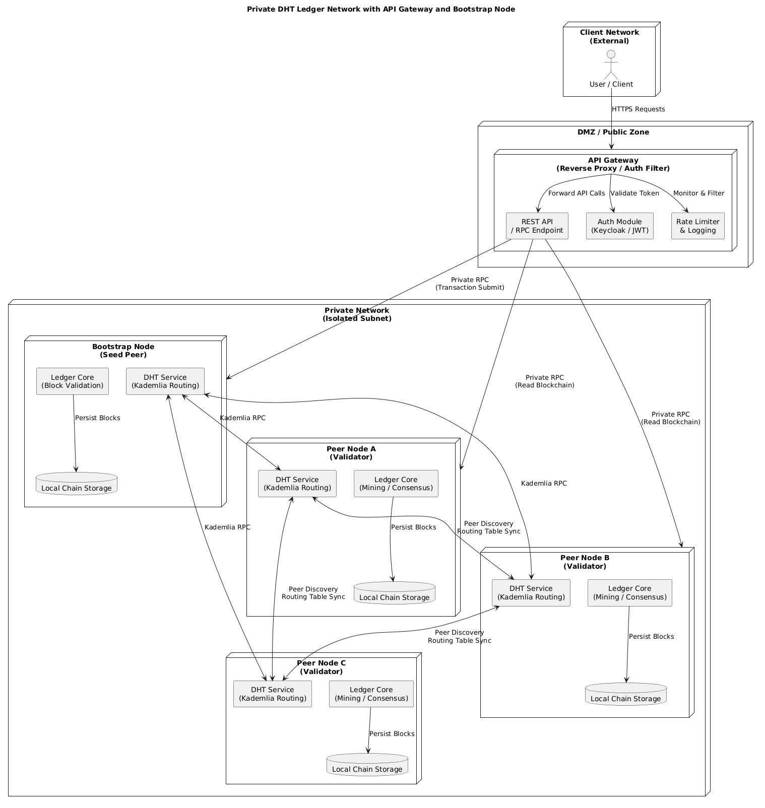

# Blockchain Mechanisms

**Implementação de uma blockchain distribuída para suportar leilões (auctions) e licitações**, com mecanismo de mineração e estratégias de mitigação de vetores de ataque.

---

# Iniciar o Projeto

Para iniciar o projeto corretamente, é necessário configurar os ficheiros `.env` e executar os serviços via Docker Compose.

## Configuração do `.env` (diretório principal)

Crie um ficheiro chamado `.env` no diretório principal do projeto:

```text
POSTGRES_DB=keycloak
POSTGRES_USER=keycloak
POSTGRES_PASSWORD=keycloak_password
KEYCLOAK_ADMIN=admin
KEYCLOAK_ADMIN_PASSWORD=admin_password
KC_HOSTNAME=localhost
KC_HOSTNAME_PORT=8020

FRONTEND_URL=http://localhost:3001
DEFAULT_USER_PASSWORD=password

VAULT_SECRET_PASS=admin
```


Configuração do .env (diretório client)

Crie um ficheiro `.env` dentro do diretório client:

```text
VITE_PORT=3001
VITE_NODE_ENV=development
VITE_API_GATEWAY_URL=http://localhost:8080

VITE_KEYCLOAK_URL=http://localhost:8020
VITE_KEYCLOAK_REALM=dht-ledger
VITE_KEYCLOAK_CLIENT=react-app
```

Para simular uma rede privada utilizando os algoritmos Kademlia, vamos iniciar o projeto com Docker.

```shell
docker compose build--no-cache
docker compose up-d
```

Em seguida, abra no terminal cada instância do processo usando o comando `docker attach`, associado a cada serviço. Abaixo segue um exemplo atual do `docker compose`:

```shell
docker attach bootstrap-node # bootstrap
docker attach peer-8001 # peer 1
docker attach peer-8002 # peer 2
docker attach peer-8003 # peer 3
docker attach peer-8004 # peer 4
docker attach peer-8005 # peer 5
docker attach peer-8006 # peer 6
docker attach peer-8007 # peer 7
docker attach peer-8008 # peer 8
docker attach peer-8009 # peer 9
docker attach peer-8010 # peer 10
```

Ao iniciar cada processo, ao executar o comando `docker attach peer-8010`, pressione as teclas de 1 a 5 — o menu de opções deve aparecer.

---


# Table of contents

1. [Architecture Software](./Kademlia-network/readme.md)
2. [Tolerance Mechanism](./docs/toleranceMechanism/README.md)
3. [Replication](./docs/replication/README.md)
4. [Handshake de Autenticação Mútua a 3 Vias (3-Way Mutual Authentication))](./docs/proofofPossession/README.MD)
5. [Metric](./docs/metric/README.md)
6. [Security Architecture of a Distributed P2P Network for Auctions](./docs/SecurityArchitecture/README.md)
7. [Docker Security](./docs/docker/securityDocker.md)

## 1. Introdução

Este projecto tem como objetivo criar **um conjunto de nós P2P** capazes de:

* **Minerar blocos** usando Proof‑of‑Work (PoW) com dificuldade configurável.
* **Executar leilões**, armazenando as licitações como transações dentro dos blocos.
* **Garantir a segurança** da rede face a ataques comuns em sistemas distribuídos (replay, Sybil, DDoS, *double‑spend*, etc.).

A solução foi desenvolvida em **Java 21** (compatível com versões anteriores) e usa apenas bibliotecas nativas da JDK (para criptografia) e **PlantUML** para os diagramas de arquitetura.

---

## 2. Visão geral do system design

O projeto assenta numa topologia de segregação de redes rigorosa, estabelecendo uma Zona Desmilitarizada (DMZ) para isolar a infraestrutura primária de acessos externos. No perímetro desta zona, opera uma Web Application Firewall (WAF) posicionada estrategicamente à frente do API Gateway. Esta fronteira de inspeção profunda (Camada 7) analisa todo o tráfego originado pela aplicação cliente (React SPA), atuando como a primeira linha de defesa contra injeções maliciosas e anomalias de protocolo. O fluxo validado é então roteado para o API Gateway, que funciona como reverse proxy e centraliza mecanismos críticos de segurança. Este componente assegura a autenticação federada, delegada a um Identity Provider (Keycloak) para a emissão e validação de tokens de sessão, a limitação de taxa de pedidos (rate limiting) e a auditoria centralizada. O gateway impõe ainda políticas estritas de hardening, nomeadamente a sanitização de cabeçalhos HTTP, a gestão de ligações persistentes (TCP keep-alive) e a mitigação de vetores de exaustão de sessões.

A imposição deste afunilamento estrutural garante que a malha descentralizada (mesh) do ledger privado não seja exposta diretamente à internet. Todo o tráfego externo tem de ultrapassar a avaliação combinada da WAF e do Gateway antes de alcançar os motores de consenso e os nós validadores. Esta topologia reduz drasticamente a superfície de ataque global, neutralizando tentativas de intrusão diretas, ataques de Negação de Serviço (DoS) e anomalias de roteamento direcionadas aos processos internos da Tabela de Dispersão Distribuída (DHT).

Na rede privada, o diagnóstico e a saúde do sistema são garantidos por uma Camada de Observabilidade intrinsecamente isolada. A arquitetura implementa um agente OpenTelemetry em cada nó peer-to-peer, responsável por extrair a telemetria a partir do contexto local e das ligações TCP de cada servidor virtualizado.  O Prometheus opera como o motor de agregação, executando a recolha (pull) periódica destas métricas temporais expostas pelos agentes. A análise visual e correlacional deste acervo de dados é delegada ao Grafana, cujo acesso ao painel de administração exige integração com o sistema de autenticação central do Keycloak, assegurando que os relatórios topológicos e o estado da infraestrutura sejam estritamente acedidos por administradores credenciados.



## 2. Visão geral da arquitectura software

Este projecto é estruturado segundo os princípios da **Clean Architecture**, tendo como núcleo central o domínio, onde são representadas as entidades fundamentais do sistema. Neste domínio residem os objectos que modelam os conceitos essenciais, nomeadamente blocos, transacções e nós, sendo estas entidades independentes de qualquer preocupação relacionada com infraestrutura, transporte ou persistência.

### Camada de Serviços de Aplicação

Sobre o domínio assenta a camada de serviços de aplicação, responsável pela implementação da lógica de negócio. Esta camada orquestra o envio e a obtenção de dados de acordo com as regras definidas, garantindo que todas as operações respeitam as invariantes do domínio. Importa sublinhar que esta lógica não conhece detalhes de serialização, protocolos de comunicação ou mecanismos de armazenamento, mantendo-se isolada dessas responsabilidades.

### Camada de Infraestrutura

A camada de infraestrutura trata das preocupações técnicas externas ao domínio, incluindo a persistência de dados e a sua serialização. É nesta camada que os dados do sistema são armazenados e recuperados, bem como convertidos para formatos adequados ao meio de armazenamento ou transmissão, sem interferir com a lógica de negócio.

### Camada de Gateway

A camada de gateway desempenha um papel crítico na fronteira do sistema, sendo responsável pela transformação dos dados recebidos em formato bruto para objectos compreensíveis pelas camadas internas. Esta camada converte dados recebidos sob a forma de bytes na construção de objectos de domínio ou de transferência, que são posteriormente encaminhados para os adaptadores apropriados. No contexto deste projecto, os dados são transmitidos em formato JSON, com o conteúdo codificado em Base64, exigindo uma desserialização rigorosa antes de qualquer processamento lógico.

---

## 3. Modelo de ameaças (Threat Model)
A modelagem de ameaças fundamenta-se na metodologia STRIDE durante as fases de engenharia e concepção de software (Security by Design), o que permite a avaliação da arquitetura do sistema antes da sua implementação. Para garantir a resiliência sistêmica, o framework MITRE ATT&CK (via Navigator) é utilizado para mapear vetores de ataque reais e possíveis. Essa abordagem permite que, durante a construção da rede e do software, possamos analisar e mitigar potenciais vulnerabilidades de forma antecipada. 

| Vetor de ataque | Impacto potencial | Contramedida implementada |
| :--- | :--- | :--- |
| **Replay / replay‑nonce** | Mensagens reutilizadas para pular etapas de handshake ou de sincronização. | Cada mensagem inclui *nonce* e *timestamp*; o `SecurityValidator` rejeita mensagens fora da janela de tempo (±5 s). |
| **Sybil / identidade falsa** | Criação de múltiplas identidades para manipular o consenso. | `NodeId` gerado a partir de *proof‑of‑work* ligado ao par de chaves (PK). O PoW impede a criação massiva de identidades. |
| **Double‑spend (transação duplicada)** | Uma licitação é incluída em dois blocos diferentes. | `BlockProcessor` verifica se o *txId* já existe no *ledger* ou no *orphan pool*. |
| **DDoS / flood de mensagens** | Sobrecarga de recursos e perda de mensagens. | Limitação de taxa (`Rate‑limit`) no `SecurityValidator`, e *back‑pressure* nas filas internas do `ConnectionHandler`. |
| **Man‑in‑the‑middle (MITM)** | Interceptação dos canais de troca de chaves. | As chaves públicas são trocadas apenas dentro da mensagem `HELLO`, que já está assinada e inclui a PoW; qualquer alteração invalida a assinatura. |
| **Eavesdropping (escuta passiva)** | Leitura de mensagens não‑confidenciais. | Tráfego de controle (`HELLO`, `GET_STATUS`, `FIND_NODE`) é criptografado usando **ECDH** → AES‑GCM. |
| **Corrupt payload (buffer overflow)** | Dados danificados que podem travar o nó. | Cada mensagem tem um **campo de tamanho** fixo; o `MessageUtils` descarta pacotes cujo tamanho exceda o limite configurado (default 2 MiB). |
| **Identidade falsificada / Bid injection** | Lances criados por atores que não detêm a chave do licitante. | **Proof‑of‑Possession (PoP)**: cada lance inclui assinatura ECDSA verificável; transações sem PoP são rejeitadas. |
| **Eclipse attack (Rede P2P)** | Vizinhos mal‑intencionados isolam o nó. | Kademlia garante **k = 20** contactos aleatórios por bucket; políticas de *refresh* evitam concentração de vizinhos. |
| **Selfish mining** | Minerar em segredo para ganhar vantagem. | Diferença de dificuldade reajustada a cada **N** blocos; penalização reduz recompensa de nós que atrasam a propagação (`BLOCK_LATENCY`). |
| **Routing table poisoning** | Inserção de pares falsos. | Cada entrada da tabela tem que ser verificada por `SecurityValidator` (PoW + assinatura `HELLO`). |
| **Replay de blocos antigos** | Re‑inserção de blocos já confirmados. | Cada bloco possui `height`; blocos com `height < currentHeight‑5` são rejeitados. |
| **DoS de mensagens INV** | Flood de anúncios de blocos. | Rate‑limit de `INV` a **10 msg/s** por vizinho. |
| **Race conditions em Pub/Sub** | Publicações simultâneas podem gerar estados conflitantes. | Operações de subscrição tornam‑se **Read‑Modify‑Write** com *merge* e *TTL*; o `SubscriptionScheduler` garante renovação periódica e purga de entradas expiradas. |
| **Maleabilidade de transações** | Alteração do *hash* da transação antes da confirmação, sem invalidar a assinatura, gerando inconsistências no rastreamento. | Normalização estrita de assinaturas criptográficas (ex: forçar valor *S* baixo em ECDSA) e segregação dos dados da assinatura no cálculo do *txId*. |
| **Timejacking (Manipulação de tempo)** | Dessincronização do relógio do nó através de *timestamps* forjados, causando rejeição de blocos válidos e fragmentação do *ledger*. | O tempo de aceitação é validado usando a mediana dos *timestamps* dos pares, com rejeição de nós cujo desvio exceda a tolerância de rede do sistema. |
| **Ataques de roteamento (BGP Hijacking)** | Particionamento da rede ou atraso na propagação manipulando a infraestrutura da internet (ISPs), isolando conjuntos de nós. | Diversificação da tabela de roteamento exigindo pares de diferentes prefixos de rede (/24) e validação criptográfica ponta a ponta irrestrita nas rotas. |
| **Sybil em Misturadores (Mixers)** | Desanonimização de transações e bloqueio de protocolo através do preenchimento de *pools* com identidades controladas pelo atacante. | Exigência estrita de colateral financeiro (taxa) e validação do PoW do `NodeId` antes de admitir pares em rondas conjuntas de transação. |
| **Eclipse Attack (Topologia de Consenso)** | Saturação das conexões de entrada/saída de um nó para monopolizar a sua visão da *blockchain* e facilitar *double-spend*. | Restrição do número de conexões aceites da mesma sub-rede IP e manutenção de uma base de dados local de pares fidedignos e historicamente estáveis (*anchor peers*). |

## Estratégia de testes

| Cenário de teste                                | Descrição                                                                         | Resultado esperado                                                                                                                                          |
| ------------------------------------------------ | ----------------------------------------------------------------------------------- | ----------------------------------------------------------------------------------------------------------------------------------------------------------- |
| **Desligamento de nós (fault tolerance)** | Desconectar aleatoriamente 30 % dos nós durante a execução de leilões.         | O leilão continua, as subscrições expiradas são removidas e novos nós podem assinar.                                                                   |
| **Ataque Eclipse a um nó**                | Um atacante tenta preencher todos os buckets de um nó alvo com identidades falsas. | O nó ainda descobre nós externos após o*refresh* e mantém sua lista de subscritores íntegra.                                                         |
| **Ataque Sybil**                           | Injetar 50 identidades falsas na rede.                                              | A PoW na geração do `NodeId` impede que mais do que o limite configurado (por ex. 5) sejam aceitos; as transações dessas identidades são rejeitadas. |
| **Simulação de leilão descentralizado** | Criar um leilão, 10 participantes enviam lances simultâneos.                      | Todos os lances são incluídos em blocos válidos, a assinatura (PoP) é verificada e o vencedor é corretamente determinado.                              |
| **Renovação de subscrições (TTL)**     | Um nó subscreve a um leilão, depois de 2 min fica inativo; o TTL = 5 min.       | Após 5 min, a entrada do nó desaparece da DHT e não recebe mais notificações.                                                                         |
| **Proof‑of‑Possession**                  | Enviar um lance com assinatura inválida.                                           | O `BlockProcessor` rejeita a transação e registra evento de segurança.                                                                                 |
| **Bloqueio de mensagens oversized**        | Enviar mensagem com payload > 2 MiB.                                               | O `MessageUtils` responde com `ERROR(EXCEEDS_MAX_SIZE)` e descarta o pacote.                                                                            |
| **Replay de bloco antigo**                 | Propagar bloco com `height` inferior ao atual em 6.                               | Os nós rejeitam o bloco; o ledger permanece consistente.                                                                                                   |

## 4. Resolução dos problemas apontados

### 4.1. Ordenação de mensagens de segurança

* Cada mensagem contém um **sequencial number** (`msgSeq`) gerado a partir do **Hybrid Logical Clock** (HLC) do nó emissor.
* O recebedor mantém um **set** de `msgSeq` já processados; mensagens fora de ordem são enfileiradas até que os antecedentes cheguem ou até expirar (30 s).

### 4.2. Assíncronia dos peers

* O `ConnectionHandler` usa **queues não‑bloqueantes** (`LinkedBlockingQueue`).
* Quando um peer falha ao processar uma mensagem (ex.: exceção de validação), a mensagem é **re‑encaminhada** para a fila de *retry* com número máximo de tentativas (3).
* Caso a fila de retry esgote, o nodo é **penalizado** na reputação e, se necessário, a conexão é fechada.

### 4.3. Evitar transações duplicadas

* Cada `Transaction` tem um **hash SHA‑256** (`txId`).
* O `BlockProcessor` consulta um **Cache** (`ConcurrentHashMap<String, Boolean>`) contendo todos os `txId` já confirmados ou presentes no `orphanPool`.
* Se a transação já existir, ela é descartada e um **log** de tentativa de *double‑spend* é emitido para o `ReputationManager`.

### 4.4. Confiança nos nós (Trust model)

1. **Proof‑of‑Work incluído no NodeId** – comprova investimento computacional.
2. **Reputation score** – começa em `0.5` e evolui com:
   * `PING_SUCCESS` (latência baixa)
   * `FIND_NODE_USEFUL` (fornece nós úteis)
   * `BLOCK_VALID` (envia blocos válidos)
3. **Blacklist** – nós com score < `0.1` são ignorados e a sua informação incide em um *penalty* na rede.

### 4.5. Gestão de mensagens demasiado grandes (buffer overflow)

* O cabeçalho da mensagem inclui **`payloadLength`** (int, max = 2 048 576 bytes).
* Caso o comprimento declarado seja maior que o limite, o `MessageUtils` responde com um **`ERROR`** contendo `EXCEEDS_MAX_SIZE`.
* O remetente pode então **re‑enviar** a mensagem em *chunks* utilizando o tipo de mensagem `GET_DATA` (similar a BitTorrent).

### 4.6. Descoberta do bootstrap (super‑node)

* Cada cliente tem uma **lista estática** (`bootstrap.list`) contendo endereços IP + porta de nós confiáveis.
* Na primeira tentativa de conexão, o nó tenta sequencialmente até obter sucesso.
* Depois de validado, o bootstrap localiza‑se no **Kademlia DHT** e é inserido na `RoutingTable`, permitindo que novos nós o utilizem como ponto de partida.

### 4.7. Vetores de ataque pós‑autenticação & mitigação

| Vetor pós‑auth                                                     | Medida de mitigação                                                                                                                                                     |
| -------------------------------------------------------------------- | ------------------------------------------------------------------------------------------------------------------------------------------------------------------------- |
| **Eclipse attack** – vizinhos mal‑intencionados isolam o nó | O algoritmo Kademlia garante que cada nodo conhece**k = 20** contactos aleatórios em cada bucket; políticas de *refresh* evitam a concentração de vizinhos. |
| **Selfish mining** – minerar em segredo para ganhar vantagem  | A dificuldade de PoW é reajustada a cada**N** blocos; o algoritmo de penalização reduz a recompensa de nós que atrasam a propagação (`BLOCK_LATENCY`).      |
| **Routing table poisoning** – inserção de pares falsos      | Cada entrada da tabela tem que ser verificada pelo `SecurityValidator` (PoW + assinatura do `HELLO`).                                                                 |
| **Replay de blocos antigos**                                   | Cada bloco possui um `height`; blocos com `height` menor que o **currentHeight‑5** são rejeitados.                                                            |
| **DoS de mensagens INV**                                       | Rate‑limit de `INV` a **10 msg/s** por vizinho.                                                                                                                 |

### 4.8. Mecanismo de propagação de blocos

1. **InvBroadcast** – ao criar um bloco válido, o nó envia `INV(Type=BLOCK, hash)` a todos os vizinhos.
2. Cada vizinho que ainda não conhece o hash responde com `GET_BLOCK(hash)`.
3. O bloco é enviado em **uma única transmissão** (`BLOCK(fullPayload)`).
4. O emissor mantém **um set de `sentInvHashes`** para evitar re‑envio desnecessário.

### 4.9. Armazenamento seguro de chaves públicas/privadas

* **Keystore Java (JCEKS)** – chaves privadas são armazenadas encriptadas com uma *passphrase* fornecida no arranque da aplicação.
* **Proteção de integridade** – o keystore contém um *MAC* SHA‑256 que impede alterações não detectadas.
* **Backup** – um ficheiro `keystore.bak` criptografado é criado após cada bloco minerado (checkpoint).
* **Hardware Security Module (HSM) – opcional**: a camada `IsKeysInfrastructure` suporta integração via PKCS#11.

### 4.10. Garantia da integridade dos identificadores

* **NodeId = Hash(PoW || publicKey || nonce)** – gera‑se um número de prova de trabalho cujo custo impede a criação arbitrária de IDs.
* Cada `NodeId` é incluído em todas as mensagens `HELLO`.
* O `SecurityValidator` recalcula o hash no recebimento e verifica a igualdade; qualquer manipulação resulta em rejeição.

### 4.11. Race codictiosn Auactiosn ao Pub/Sub

Em ambientes distribuídos que combinam Pub/Sub com a camada de descoberta/armazenamento Kademlia, os nós frequentemente executam ciclos Read‑Modify‑Write (RMW) sobre recursos compartilhados (por exemplo, leilões). Cada nó pode:

1) Ler o estado atual de um recurso.
2) Aplicar uma modificação local (ex.: registrar um novo lance).
3) Escrever a nova versão de volta ao DHT.

Devido à latência da rede e à ausência de um coordenador central, dois ou mais nós podem publicar simultaneamente alterações que, embora referenciem o mesmo recurso, possuam identificadores de operação diferentes. O resultado são mensagens duplicadas ou versões conflitantes nos assinantes.

- Condições de corrida: duas publicações concorrentes podem chegar em ordem diferente nos consumidores, gerando estados inconsistentes.
- Duplicação de eventos: o mesmo leilão pode ser entregue duas vezes, cada uma com um operationId distinto, provocando reprocessamento desnecessário e, possivelmente, decisões conflitantes (ex.: aceitação de dois lances diferentes para o mesmo instante).

### 4.12. Outros problemas típicos de sistemas distribuídos

| Problema                                     | Solução                                                                                                                                             |
| -------------------------------------------- | ----------------------------------------------------------------------------------------------------------------------------------------------------- |
| **Partição de rede (network split)** | O algoritmo de consenso permite*forks* temporárias; o nó mantém o **fork mais longo** (GHOST) e reconcilia assim que a partição termina. |
| **Clock drift**                        | Uso de**Hybrid Logical Clock** (HLC) em vez de timestamps puros.                                                                                |
| **Persistência de dados**             | Cada bloco é gravado em**Append‑Only Log** (arquivo `chain.log`), com *fsync* garantido a cada *epoch* de 10 blocos.                    |
| **Escalabilidade da DHT**              | Buckets Kademlia são mantidos com tamanho máximo de 20; limpeza automática de nós inativos a cada 5 min.                                         |

---

# Testing Phase

## Goals

Descrever e organizar os casos de teste implementados para validar as principais propriedades do sistema descentralizado (tolerância a falhas, segurança contra ataques e funcionalidade de leilões).

---

## Test Scenarios

- [X] **Desligamento de nós (tolerância a falhas)**: Simular a indisponibilidade de alguns nós e verificar se o sistema continua operando corretamente, mantendo a **preservação de dados imutáveis**.
- [X] **Ataque Eclipse a um nó**: Um nó tenta isolar outros nós da rede, testando a resiliência do mecanismo de descoberta e das rotas de comunicação.
- [X] **Ataque Sybil**: Tentar inserir identidades falsas que sobrescrevam ou corrompam o estado do ledger, verificando a capacidade do protocolo de detectar e rejeitar esses nós.
- [X] **Simulação de leilão descentralizado**: Executar um leilão onde os participantes podem criar e registar novos objetos/ativos no ledger.
- [X] **Demonstração do projeto descentralizado**: Mostrar a interação entre nós, a rede P2P e os contratos inteligentes num cenário real de utilização.
- [X] **Autenticação entre nós (Proof-of-Validation)**: Implementar um *challenge-response* baseado em **Proof-of-Possession** para garantir que apenas nós autenticados possam ingressar na rede.
- [X] **Simulação de licitações duplicadas e rejeição de valores baixos em leilão**: Validar que transações duplicadas são detectadas e rejeitadas, e que lances abaixo do valor mínimo configurado são descartados, garantindo a integridade dos dados no ledger.
- [X] **Simulação de concorrência de licitações**: Validar que múltiplas licitações num leilão enviadas sequencialmente em todas as máquinas são lidas pela mesma ordem e rejeitadas caso não cumpram com as regras de negócio.
- [X] **Simulação de condições de corrida em leilões**: Criar vários leilões simultaneamente e enviar licitações com pedidos concorrentes de dados para verificar integridade e consistência.

### Referências
1. Blockchain Attack Vectors & Vulnerabilities to Smart Contracts, https://cryptodeeptech.ru/blockchain-attack-vectors/

2. Blockchain Variables and Possible Attacks: A Technical Survey, https://www.mdpi.com/2073-431X/14/12/567