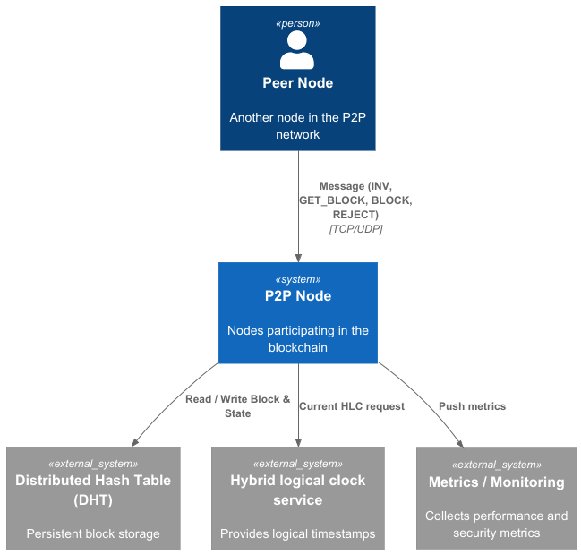
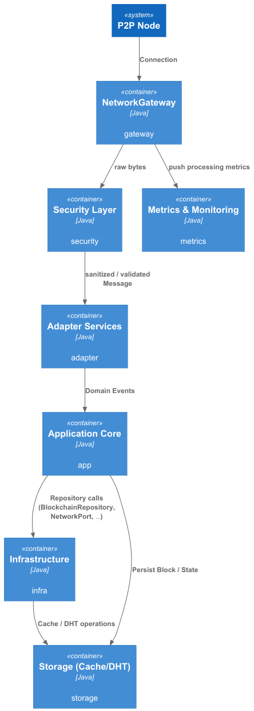
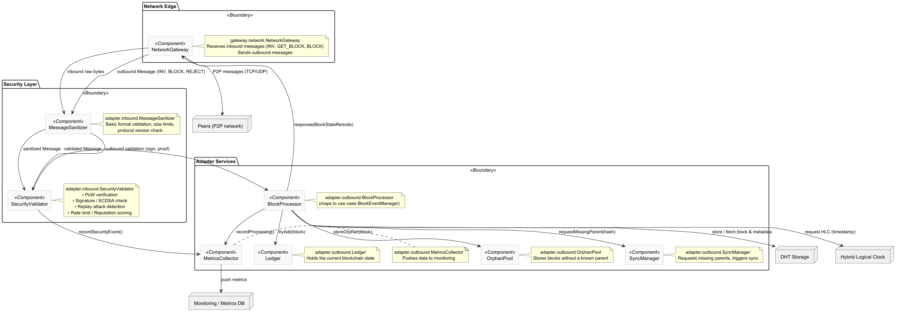
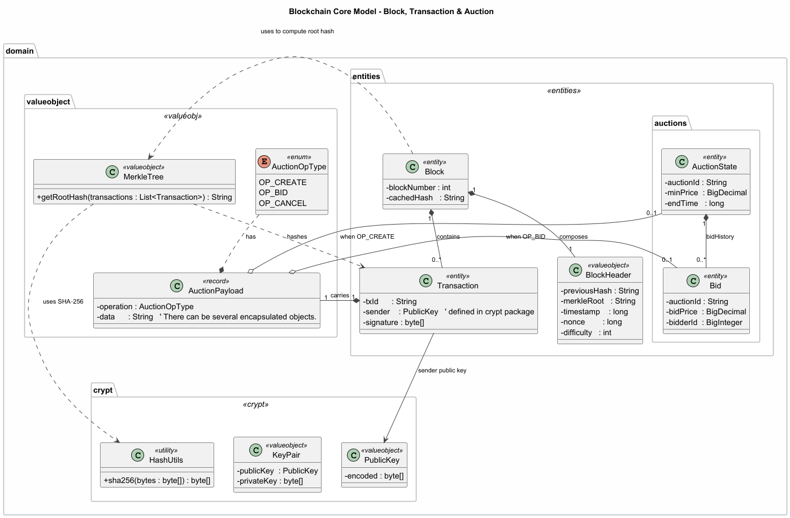

# Blockchain Mechanisms

**Implementação de uma blockchain distribuída para suportar leilões (auctions) e licitações**, com mecanismo de mineração e estratégias de mitigação de vetores de ataque.

---  

## 1. Introdução

Este projecto tem como objetivo criar **um conjunto de nós P2P** capazes de:

* **Minerar blocos** usando Proof‑of‑Work (PoW) com dificuldade configurável.
* **Executar leilões**, armazenando as licitações como transações dentro dos blocos.
* **Garantir a segurança** da rede face a ataques comuns em sistemas distribuídos (replay, Sybil, DDoS, *double‑spend*, etc.).

A solução foi desenvolvida em **Java 21** (compatível com versões anteriores) e usa apenas bibliotecas nativas da JDK (para criptografia) e **PlantUML** para os diagramas de arquitetura.

---  

## 2. Visão geral da arquitectura  
Este projecto é estruturado segundo os princípios da **Clean Architecture**, tendo como núcleo central o domínio, onde são representadas as entidades fundamentais do sistema. Neste domínio residem os objectos que modelam os conceitos essenciais, nomeadamente blocos, transacções e nós, sendo estas entidades independentes de qualquer preocupação relacionada com infraestrutura, transporte ou persistência.

## Camada de Serviços de Aplicação

Sobre o domínio assenta a camada de serviços de aplicação, responsável pela implementação da lógica de negócio. Esta camada orquestra o envio e a obtenção de dados de acordo com as regras definidas, garantindo que todas as operações respeitam as invariantes do domínio. Importa sublinhar que esta lógica não conhece detalhes de serialização, protocolos de comunicação ou mecanismos de armazenamento, mantendo-se isolada dessas responsabilidades.

## Camada de Infraestrutura

A camada de infraestrutura trata das preocupações técnicas externas ao domínio, incluindo a persistência de dados e a sua serialização. É nesta camada que os dados do sistema são armazenados e recuperados, bem como convertidos para formatos adequados ao meio de armazenamento ou transmissão, sem interferir com a lógica de negócio.

## Camada de Gateway

A camada de gateway desempenha um papel crítico na fronteira do sistema, sendo responsável pela transformação dos dados recebidos em formato bruto para objectos compreensíveis pelas camadas internas. Esta camada converte dados recebidos sob a forma de bytes na construção de objectos de domínio ou de transferência, que são posteriormente encaminhados para os adaptadores apropriados. No contexto deste projecto, os dados são transmitidos em formato JSON, com o conteúdo codificado em Base64, exigindo uma desserialização rigorosa antes de qualquer processamento lógico.

---  

## 3. Modelo de ameaças (Threat Model)

| Vetor de ataque                                 | Impacto potencial | Contramedida implementada |
|-----------------------------------------------|-------------------|---------------------------|
| **Replay / replay‑nonce**                       | Mensagens reutilizadas para saltar etapas de handshake ou de sincronização. | Cada mensagem inclui **nonce** e **timestamp**; o `SecurityValidator` rejeita mensagens fora da janela de tempo (±5 s). |
| **Sybil / identidade falsa**                  | Um nó cria múltiplas identidades para manipular o consenso. | O **NodeId** é gerado a partir de um *proof‑of‑work* ligado ao par de chaves (PK). O PoW impede a criação massiva de identidades. |
| **Double‑spend (transação duplicada)**         | Uma licitação é incluída em dois blocos diferentes. | Antes de aceitar uma transação, o `BlockProcessor` verifica se o *txId* já existe no *ledger* ou no *orphan pool*. |
| **DDoS / flood de mensagens**                | Sobrecarga de recursos e perda de mensagens. | Limitação de taxa (`Rate‑limit`) no `SecurityValidator`, e mecanismo de **back‑pressure** nas filas internas do `ConnectionHandler`. |
| **Man‑in‑the‑middle (MITM)**                  | Interceptação dos canais de troca de chaves. | As chaves públicas são trocadas apenas dentro da mensagem `HELLO`, que já está assinada e inclui a PoW; qualquer alteração invalida a assinatura. |
| **Eavesdropping (escuta passiva)**            | Leitura de mensagens não‑confidenciais. | Todo o tráfego de controlo (`HELLO`, `GET_STATUS`, `FIND_NODE`) é criptografado usando **ECDH** para gerar uma sessão AES‑GCM. |
| **Corrupt payload (buffer overflow)**          | Dados danificados que podem travar o nó. | Cada mensagem tem um **campo de tamanho** fixo; o `MessageUtils` descarta pacotes cujo tamanho exceda o limite configurado (default 2 MiB). |

---  

## 4. Resolução dos problemas apontados

### 4.1. Ordenação de mensagens de segurança

* Cada mensagem contém um **sequencial number** (`msgSeq`) gerado a partir do **Hybrid Logical Clock** (HLC) do nó emissor.
* O recebedor mantém um **set** de `msgSeq` já processados; mensagens fora de ordem são enfileiradas até que os antecedentes cheguem ou até expirar (30 s).

### 4.2. Assíncronia dos peers

* O `ConnectionHandler` usa **queues não‑bloqueantes** (`LinkedBlockingQueue`).
* Quando um peer falha ao processar uma mensagem (ex.: exceção de validação), a mensagem é **re‑encaminhada** para a fila de *retry* com número máximo de tentativas (3).
* Caso a fila de retry esgote, o nodo é **penalizado** na reputação e, se necessário, a conexão é fechada.

### 4.3. Evitar transações duplicadas

* Cada `Transaction` tem um **hash SHA‑256** (`txId`).
* O `BlockProcessor` consulta um **Cache** (`ConcurrentHashMap<String, Boolean>`) contendo todos os `txId` já confirmados ou presentes no `orphanPool`.
* Se a transação já existir, ela é descartada e um **log** de tentativa de *double‑spend* é emitido para o `ReputationManager`.

### 4.4. Confiança nos nós (Trust model)

1. **Proof‑of‑Work incluído no NodeId** – comprova investimento computacional.
2. **Reputation score** – começa em `0.5` e evolui com:
    * `PING_SUCCESS` (latência baixa)
    * `FIND_NODE_USEFUL` (fornece nós úteis)
    * `BLOCK_VALID` (envia blocos válidos)
3. **Blacklist** – nós com score < `0.1` são ignorados e a sua informação incide em um *penalty* na rede.

### 4.5. Gestão de mensagens demasiado grandes (buffer overflow)

* O cabeçalho da mensagem inclui **`payloadLength`** (int, max = 2 048 576 bytes).
* Caso o comprimento declarado seja maior que o limite, o `MessageUtils` responde com um **`ERROR`** contendo `EXCEEDS_MAX_SIZE`.
* O remetente pode então **re‑enviar** a mensagem em *chunks* utilizando o tipo de mensagem `GET_DATA` (similar a BitTorrent).

### 4.6. Descoberta do bootstrap (super‑node)

* Cada cliente tem uma **lista estática** (`bootstrap.list`) contendo endereços IP + porta de nós confiáveis.
* Na primeira tentativa de conexão, o nó tenta sequencialmente até obter sucesso.
* Depois de validado, o bootstrap localiza‑se no **Kademlia DHT** e é inserido na `RoutingTable`, permitindo que novos nós o utilizem como ponto de partida.

### 4.7. Vetores de ataque pós‑autenticação & mitigação

| Vetor pós‑auth  | Medida de mitigação |
|----------------|---------------------|
| **Eclipse attack** – vizinhos mal‑intencionados isolam o nó | O algoritmo Kademlia garante que cada nodo conhece **k = 20** contactos aleatórios em cada bucket; políticas de *refresh* evitam a concentração de vizinhos. |
| **Selfish mining** – minerar em segredo para ganhar vantagem | A dificuldade de PoW é reajustada a cada **N** blocos; o algoritmo de penalização reduz a recompensa de nós que atrasam a propagação (`BLOCK_LATENCY`). |
| **Routing table poisoning** – inserção de pares falsos | Cada entrada da tabela tem que ser verificada pelo `SecurityValidator` (PoW + assinatura do `HELLO`). |
| **Replay de blocos antigos** | Cada bloco possui um `height`; blocos com `height` menor que o **currentHeight‑5** são rejeitados. |
| **DoS de mensagens INV** | Rate‑limit de `INV` a **10 msg/s** por vizinho. |

### 4.8. Mecanismo de propagação de blocos

1. **InvBroadcast** – ao criar um bloco válido, o nó envia `INV(Type=BLOCK, hash)` a todos os vizinhos.
2. Cada vizinho que ainda não conhece o hash responde com `GET_BLOCK(hash)`.
3. O bloco é enviado em **uma única transmissão** (`BLOCK(fullPayload)`).
4. O emissor mantém **um set de `sentInvHashes`** para evitar re‑envio desnecessário.

### 4.9. Armazenamento seguro de chaves públicas/privadas

* **Keystore Java (JCEKS)** – chaves privadas são armazenadas encriptadas com uma *passphrase* fornecida no arranque da aplicação.
* **Proteção de integridade** – o keystore contém um *MAC* SHA‑256 que impede alterações não detectadas.
* **Backup** – um ficheiro `keystore.bak` criptografado é criado após cada bloco minerado (checkpoint).
* **Hardware Security Module (HSM) – opcional**: a camada `IsKeysInfrastructure` suporta integração via PKCS#11.

### 4.10. Garantia da integridade dos identificadores

* **NodeId = Hash(PoW || publicKey || nonce)** – gera‑se um número de prova de trabalho cujo custo impede a criação arbitrária de IDs.
* Cada `NodeId` é incluído em todas as mensagens `HELLO`.
* O `SecurityValidator` recalcula o hash no recebimento e verifica a igualdade; qualquer manipulação resulta em rejeição.

### 4.11. Race codictiosn Auactiosn ao Pub/Sub
Em ambientes distribuídos que combinam Pub/Sub com a camada de descoberta/armazenamento Kademlia, os nós frequentemente executam ciclos Read‑Modify‑Write (RMW) sobre recursos compartilhados (por exemplo, leilões). Cada nó pode:

1) Ler o estado atual de um recurso.
2) Aplicar uma modificação local (ex.: registrar um novo lance).
3) Escrever a nova versão de volta ao DHT.

Devido à latência da rede e à ausência de um coordenador central, dois ou mais nós podem publicar simultaneamente alterações que, embora referenciem o mesmo recurso, possuam identificadores de operação diferentes. O resultado são mensagens duplicadas ou versões conflitantes nos assinantes.
- Condições de corrida: duas publicações concorrentes podem chegar em ordem diferente nos consumidores, gerando estados inconsistentes.
- Duplicação de eventos: o mesmo leilão pode ser entregue duas vezes, cada uma com um operationId distinto, provocando reprocessamento desnecessário e, possivelmente, decisões conflitantes (ex.: aceitação de dois lances diferentes para o mesmo instante).
### 4.12. Outros problemas típicos de sistemas distribuídos

| Problema | Solução |
|----------|----------|
| **Partição de rede (network split)** | O algoritmo de consenso permite *forks* temporárias; o nó mantém o **fork mais longo** (GHOST) e reconcilia assim que a partição termina. |
| **Clock drift** | Uso de **Hybrid Logical Clock** (HLC) em vez de timestamps puros. |
| **Persistência de dados** | Cada bloco é gravado em **Append‑Only Log** (arquivo `chain.log`), com *fsync* garantido a cada *epoch* de 10 blocos. |
| **Escalabilidade da DHT** | Buckets Kademlia são mantidos com tamanho máximo de 20; limpeza automática de nós inativos a cada 5 min. |

---  

## Diagrma compoemntes 

### Visão de Sistema – System Context
Principais atores / sistemas externos

## Diagrama de Containers – Container Diagram
Containers (camadas lógicas)

## Diagrama de Componentes – Component Diagram
Principais componentes (por container)

## Modelo de Domínio – Domain Model
Entidades & Value Objects

# Testing Phase

## Goals
Descrever e organizar os casos de teste implementados para validar as principais propriedades do sistema descentralizado (tolerância a falhas, segurança contra ataques e funcionalidade de leilões).

---

## Test Scenarios

- [x] **Desligamento de nós (fault tolerance)**  
  Simular a indisponibilidade de alguns nós e verificar se o sistema continua operando corretamente, mantendo a **preservação de dados imutáveis**.

- [ ] **Ataque Eclipse a um nó**  
  Um nó tenta isolar outros nós da rede, testando a resiliência do mecanismo de descoberta e das rotas de comunicação.

- [ ] **Ataque Sybil**  
  Tentar inserir identidades falsas que sobrescrevam ou corrompam o estado do ledger, verificando a capacidade do protocolo de detectar e rejeitar esses nós.

- [x] **Simulação de leilão descentralizado**  
  Executar um leilão onde os participantes podem criar e registrar novos objetos/ativos no ledger.

- [x] **Demonstração do projeto descentralizado**  
  Mostrar a interação entre nós, a rede P2P e os contratos inteligentes em um cenário real de uso.

- [x] **Autenticação entre nós (Proof‑of‑Validation)**  
  Implementar um *challenge‑response* baseado em **Proof‑of‑Validation** para garantir que somente nós autenticados possam ingressar na rede.

---

