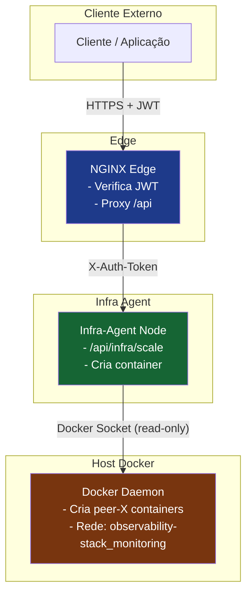

#  Infra‑Agent – Node.js + Docker

**Um agente que permite escalar dinamicamente a mesh de** *peers* **(containers Docker) de forma segura, auditável e totalmente automatizada.**

---

## Visão geral

| O que é?                                                                                                                                                                 | Por que usar?                                                                                                                                                                         |
| ------------------------------------------------------------------------------------------------------------------------------------------------------------------------- | ------------------------------------------------------------------------------------------------------------------------------------------------------------------------------------- |
| **Um serviço HTTP + WebSocket escrito em Node.js** que calcula o próximo endereço/porta e lança um container Docker (`observability-stack‑bootstrap‑node`). | Permite que*operadores* ou *orquestradores* (por exemplo, um portal React ou CI/CD) adicionem nodes a uma rede **Kademlia / P2P** com um simples `POST /api/infra/scale`. |
| **Executado dentro de um contêiner Docker “distroless”** (non‑root, read‑only, `cap‑drop ALL`).                                                             | Isolamento total, zero dependências de runtime, superfície de ataque mínima.                                                                                                       |
| **Audit‑log estruturado** (arquivo JSON) + endpoint admin protegido por `X‑API‑KEY`.                                                                           | Todas as mudanças ficam registradas e podem ser consultadas por compliance ou para debugging.                                                                                        |
| **Camada de segurança** (Helmet, CORS, rate‑limit, sanitização) + validação de JWT feita no gateway (NGINX).                                                  | O agente nunca aceita input não‑sanitizado; só responde a chamadas já autenticadas.                                                                                               |
| **Pipeline de qualidade** (ESLint + plugins de segurança, Prettier, lint‑staged, Snyk/CodeQL).                                                                  | Código consistente, livre de vulnerabilidades conhecidas antes de chegar ao*prod* .                                                                                                |

---

## Arquitetura simplificada



*O NGINX já garante a autenticação; o agente só se preocupa com a lógica de escalamento e auditoria.*

---

## Configuração de ambiente

1. Copie o modelo e preencha com os valores em:

   ```
   .env
   ```
2. Exemplo mínimo (`.env`):

   ```
   NODE_ENV=development
   PORT=4000
   CORS_ORIGIN=http://localhost:3001          # origem do front‑end
   LOG_LEVEL=info
   AUDIT_LOG_PATH=logs/audit.log
   VAULT_SECRET_PASS=admin                    # secret usado pelos peers
   AUDIT_API_KEY=super-secret-admin-key       # chave para ler /audit
   ```

---

## Instalação & execução (modo local)

```
# Instala dependências
npm i

# Inicia o agente
npm start  # http://localhost:4000
```

### Verificando se está tudo ok

```
curlhttp://localhost:4000/health
#> { "status":"ok","ts":"2026-05-16T12:00:00.000Z" }
```

---

## API – Endpoints principais

| Método        | URL                           | Descrição                                                                                                                                         | Exemplo de resposta                                                                                                                                                                                                                                                                                                                                  |
| -------------- | ----------------------------- | --------------------------------------------------------------------------------------------------------------------------------------------------- | ---------------------------------------------------------------------------------------------------------------------------------------------------------------------------------------------------------------------------------------------------------------------------------------------------------------------------------------------------- |
| **GET**  | `/health`                   | Health‑check (usado por Docker/K8s)                                                                                                                | `{ "status":"ok","ts":"2026‑05‑16T12:00:00.000Z" }`                                                                                                                                                                                                                                                                                              |
| **POST** | `/api/infra/scale`          | Cria um novo*peer* (container Docker). O agente calcula IP, portas e lança a imagem `observability-stack-bootstrap-node`.                      | `json { "status":"Success", "message":"Scaling up infrastructure with new container peer-8011 at IP 172.23.0.21 and RPC port 9012", "metadata": { "containerName":"peer-8011","peerIp":"172.23.0.21","RpcPort":9012,"newSysncPort":10011,"newHttpPort":8011 } }`                                                                                   |
| **GET**  | `/audit?limit=100&offset=0` | **Admin** – devolve as linhas mais recentes do audit‑log (JSON). Requer header `X‑API‑KEY` contendo o mesmo valor de `AUDIT_API_KEY`. | `json { "total":42,"limit":100,"offset":0,"entries":[ { "timestamp":"2026‑05‑16T12:12:34.567Z","requestId":"…","userId":"alice@example.com","action":"scale","resource":"peer","outcome":"success","ip":"172.18.0.2","details":{"container":"peer-8011","ip":"172.23.0.21","ports":{"rpcPort":9012,"syncPort":10011,"httpPort":8011}}}, … ] }` |
