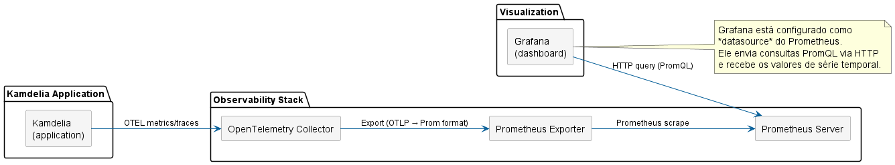

# Matriz de Observabilidade – *MetricsLogger*

O *MetricsLogger* expõe métricas de três camadas críticas do seu nó:

1. **Motor de Blockchain e Consenso** – saúde da replicação e do PoW;
2. **Segurança e Confiança (S‑Kademlia)** – detecção de adversários e reputação;
3. **Topologia P2P e Roteamento DHT** – eficiência da sobre‑posição K‑ademlia.

A tabela abaixo resume cada métrica, seu objetivo e como interpretá‑la em um cenário de “pico” ou anomalia.

---

## 1. Motor de Blockchain e Consenso (Estado)

| Métrica                  | Nome Prometheus                             | O que mede                                                       | Diagnóstico em pico/anomalia                                                                           |
| ------------------------- | ------------------------------------------- | ---------------------------------------------------------------- | ------------------------------------------------------------------------------------------------------- |
| **Chain Height**    | `blockchain_chain_height_blocks`          | Comprimento absoluto da cadeia principal validada pelo nó local | Estagnação → falha de consenso ou bloqueio de propagação de blocos                                 |
| **Mempool Size**    | `blockchain_mempool_size_transactions`    | Volume de transações pendentes em memória                     | Crescimento indefinido → excesso de taxa de submissão / dificuldade de PoW muito alta                 |
| **Broker Queue**    | `broker_event_queue_size_messages`        | Mensagens assíncronas na fila interna do nó Java               | Fila alta → back‑pressure, CPU insuficiente para processar criptografia/serialização                |
| **Mining Duration** | `blockchain_mine_duration_milliseconds`   | Tempo CPU gasto em cada tentativa de nonce                       | Picos abruptos → vulnerabilidade a spam de blocos (CPU saturada)                                       |
| **Chain Reorgs**    | `blockchain_reorganizations_reorgs_total` | Número de reorganizações de cadeia (forks resolvidos)         | Frequência alta → partição de rede, latência de propagação ou múltiplos mineradores concorrendo |

---

## 2. Segurança e Confiança – *S‑Kademlia* (IDS & Reputation)

| Métrica                                | Nome Prometheus                          | O que mede                                                                                      | Diagnóstico em pico/anomalia                                                                   |
| --------------------------------------- | ---------------------------------------- | ----------------------------------------------------------------------------------------------- | ----------------------------------------------------------------------------------------------- |
| **Malicious Activities Detected** | `skademlia_malicious_activities_total` | Contagem de violações de protocolo (injeções de rotas falsas, assinaturas inválidas, etc.) | Pico → ataque adversário detectado e mitigado na borda da rede                                |
| **Peer Trust Score**              | `skademlia_peer_trust_score`           | Reputação histórica de cada par (0.0–1.0)                                                   | Queda → desvio de roteamento ou node comprometido; deve ser excluído da árvore de roteamento |

---

## 3. Topologia P2P e Roteamento – *DHT/K‑AdE­Mil­a*

| Métrica                                 | Nome Prometheus                                  | O que mede                                                    | Diagnóstico em pico/anomalia                                                      |
| ---------------------------------------- | ------------------------------------------------ | ------------------------------------------------------------- | ---------------------------------------------------------------------------------- |
| **Network Throughput – Inbound**  | `network_inbound_throughput_bytes_per_second`  | Volume de dados recebidos por segundo                         | Desbalanceamento (inbound >> outbound) → possível DDoS ou ataque de Sybil        |
| **Network Throughput – Outbound** | `network_outbound_throughput_bytes_per_second` | Volume de dados enviados por segundo                          | Desbalanceamento (outbound >> inbound) → disponibilidade de serviço comprometida |
| **Latency (RTT)**                  | `network_latency_rtt_seconds`                  | Tempo de ida e volta em transações RPC                      | Alta latência → falha de pesquisas DHT por timeout                               |
| **Routing Table Size**             | `dht_routing_table_kbucket_size`               | Número de vizinhos ativos em cada k‑bucket                  | Tamanho muito pequeno → Hop‑count elevado, roteamento ineficiente                |
| **Storage Size**                   | `dht_storage_size_entries`                     | Quantidade de blocos/transações armazenados localmente      | Distribuição desigual (`storage_size` homogêneo) → centralização de dados  |
| **Lookup Hops**                    | `kademlia_lookup_hops`                         | Prom. de saltos necessários para resolver chave              | `> O(log n)` → rota linear, indicativo de erro de distância XOR                |
| **Errors & Avg Hops**              | `kademlia_lookup_errors_total`                 | Número de falhas de lookup                                   | Inchaço → conectividade TCP instável ou pings/gaps não calibrados              |
| **Bootstrap Latency**              | `bootstrap_latency_seconds`                    | Tempo para alcançar o ponto de entrada e completar handshake | Latência muito alta → PoW intencional atrasando on‑board de atacantes           |
| **Bootstrap Success Rate**         | `bootstrap_success_total`                      | % de nós que completaram bootstrap                           | Falhas frequentes → handshake ou verificação de identidade falhando             |
| **K‑Bucket Convergence Rate**     | `kademlia_convergence_rate_nodes_per_second`   | Velocidade de estabilização das tabelas de roteamento       | Flutuação contínua → churn excessivo, perda de pacotes TCP                     |

---

## 4. Recomendações Práticas

1. **Alertas de LTV** – Para métricas de throughput e latency, configure alertas que sirvam de referência a longo prazo (percentil 95% ou 99%); picos inesperados indicam ataques ou sobrecarga.
2. **Thresholds Dinâmicos** – Use *persistence* na fila do broker para decidir sobre back‑pressure automático. Se `broker_event_queue_size_messages` > 90% da capacidade, reduza a taxa de gravação de logs.
3. **Segurança em Layer 1** – Unifique as métricas de *Malicious Activities* com logs de rede para correlacionar taxa de injeções falsas com variações de `skademlia_peer_trust_score`.
4. **Visão Holística** – Combine métricas de “Chain Height” com `blockchain_mempool_size_transactions` para detectar “stale blocks”; se a altura escalar não acompanha o backlog de mempool, a rede está estagnada.

## 5. Normas NIS e MITRE ATT&CK

Na análise de controlo de comportamento de sistemas, considera-se relevante a utilização de métricas operacionais e de segurança que permitam avaliar a eficácia da deteção, resposta e recuperação perante incidentes de cibersegurança. Neste contexto, referenciais normativos como a Diretiva NIS (Network and Information Security) e o framework MITRE ATT&CK fornecem uma base estruturada para a identificação de padrões de ataque, correlação de eventos e melhoria contínua dos mecanismos de defesa. Estes referenciais contribuem para uma melhor capacidade de resposta a incidentes, particularmente em cenários associados a vetores de ataque comuns, incluindo ataques de negação de serviço (DoS), exploração de vulnerabilidades e movimentos laterais em redes comprometidas.

$$MTTD = \frac{\text{Soma de todos os tempos de deteção}}{\text{Número total de incidentes}}$$

$$MTTR = \frac{\text{Soma de todos os tempos de resposta/reparação}}{\text{Número total de incidentes}}$$

$$MTBF = \frac{\text{Tempo total de operação ininterrupta (uptime)}}{\text{Número de falhas}}$$

$$\text{Disponibilidade (\%)} = \frac{MTBF}{MTBF + MTTR} \times 100$$

## Mean Time to Detection
A minimização do Mean Time to Detection (MTTD) requer a monitorização exaustiva dos seguintes Service Level Indicators (SLIs), fundamentais para a proteção do Error Budget:

1. Latência:

Métrica: Medição do tempo de resposta das operações do sistema.

Aplicação SRE: Atua como o SLI primário de performance. A análise contínua de percentis (ex: p95, p99) é crítica, pois desvios padrão acentuados ou picos de latência constituem sintomas precoces de estrangulamentos (bottlenecks) na infraestrutura. Identificar esta latência latente permite mitigar a degradação antes que resulte numa falha total e na violação do SLA de tempo de resposta.

2. Débito (Throughput):

Métrica: Quantificação do volume de transações ou dados processados por unidade de tempo.

Aplicação SRE: A correlação desta métrica com a latência é obrigatória para aferir a elasticidade da arquitetura. Permite identificar de forma empírica se o sistema está a degradar a sua performance sob cargas normais de operação ou estritamente durante picos de utilização, informando decisões estruturais sobre provisionamento de recursos.

3. Tráfego de Entrada (Inbound):

Métrica: Monitorização do volume absoluto de pedidos HTTP recebidos e da respetiva taxa de sucesso operacional.

Aplicação SRE: Exige a análise rigorosa do rácio entre mensagens de sucesso (HTTP 2xx/3xx) e mensagens de erro (HTTP 4xx/5xx). Um aumento súbito na taxa de erros inbound consome o Error Budget do SLO de disponibilidade de forma acelerada, apontando de imediato para anomalias nos serviços expostos ou em processos de validação de dados.

4. Tráfego de Saída (Outbound):

Métrica: Monitorização do volume, taxa de sucesso e taxa de erro dos pedidos HTTP originados pelo sistema em direção a dependências externas (bases de dados, APIs de terceiros, microsserviços adjacentes).

Aplicação SRE: Métrica vital para o isolamento determinístico de falhas (Fault Isolation). Permite determinar de forma inequívoca se o incidente e a consequente degradação do SLO têm origem na sua própria arquitetura ou na infraestrutura de um fornecedor externo, protegendo os seus indicadores internos contra falhas de terceiros.
