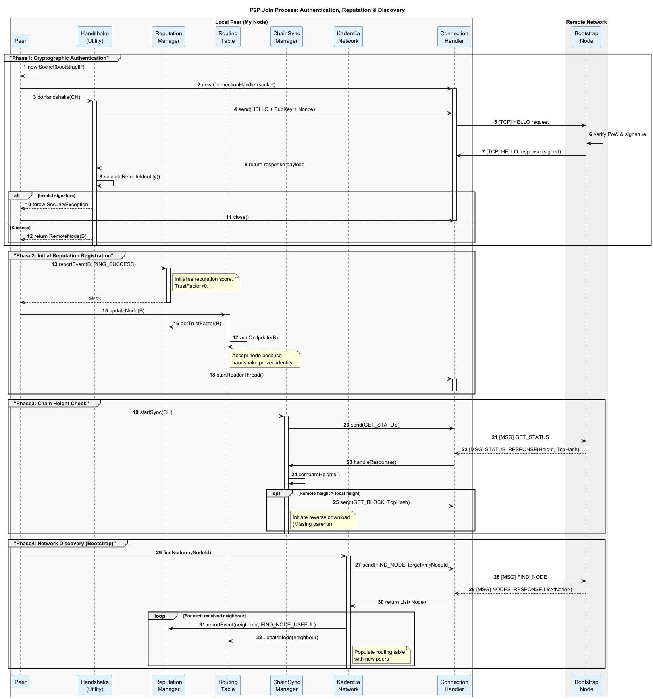

# Prova de Posse (Proof‑of‑Possession – PoP)

## Objetivo

Garantir que o `NodeId` anunciado por um peer realmente corresponde à chave pública que ele possui, impedindo ataques de identidade falsa, replay e Sybil.

## Como funciona

1. **Geração do desafio** – o nó cria a string
   `challenge = nodeId + ":" + timestamp`
   e a assina com sua chave privada.
2. **Envio** – o `challenge` assinado, o `NodeId`, a `publicKey` e a `timestamp` são enviados no `HELLO`.
3. **Validação remota**:
   * Recalcula o `NodeId` a partir da chave pública (inclui o PoW) → `NodeId.isValidNode(node, pk)`.
   * Verifica se a `timestamp` está dentro da janela de validade (ex.: ±5 s).
   * Verifica a assinatura do desafio → `CryptoUtils.verifySignature(pk, challenge, signature)`.
4. **Registro** – ao confirmar o PoP, a chave pública é armazenada e o fato é registrado no gerenciador de reputação.

### Resultado

* **Handshake aceito** somente quando todas as verificações acima são bem‑sucedidas.
* **Reputação** do peer é atualizada com o registro de PoP; falhas reduzem a pontuação e dificultam sua inserção futura nos buckets da Kademlia.

