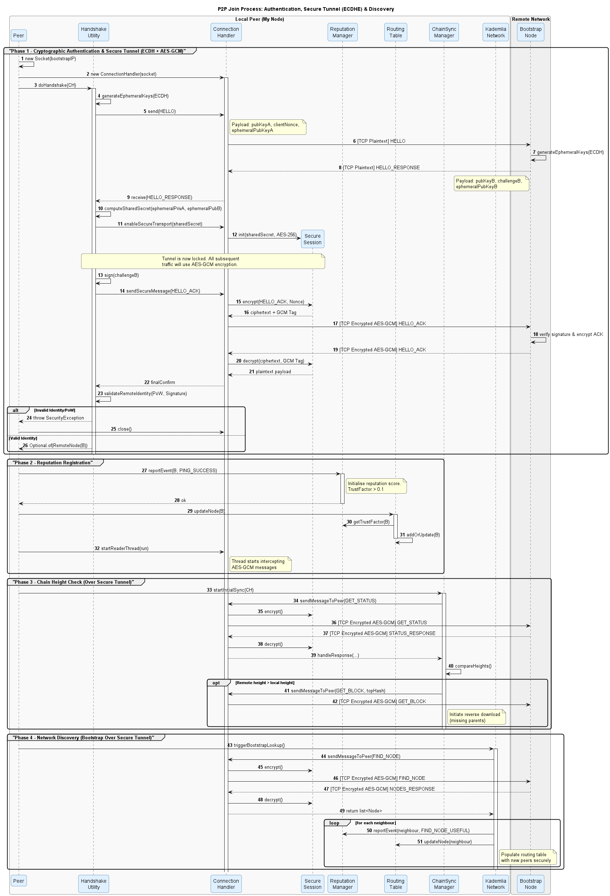

# Handshake de Autenticação Mútua a 3 Vias (3-Way Mutual Authentication)

## Objetivo

Garantir a confidencialidade e a autenticidade da comunicação entre duas entidades do sistema. Este processo assegura que o `NodeId` anunciado por um par (*peer*) corresponde criptograficamente à chave pública que este possui, mitigando ataques de falsificação de identidade, *Replay* e *Sybil*. Através deste mecanismo inicial de troca de chaves e do desafio criptográfico vinculado a um *Nonce*, é possível verificar matematicamente que a entidade que iniciou a sessão é a exata mesma entidade que a conclui, estabelecendo uma Prova de Posse (*Proof of Possession*).

## Como funciona

1. **Apresentação Inicial (`HELLO`):** As entidades iniciam a comunicação trocando dados de identificação. É enviada uma mensagem `HELLO` em texto limpo contendo a chave pública de longo prazo e uma chave pública efémera gerada exclusivamente para esta sessão.
2. **Troca de Chaves ECDH (*Elliptic Curve Diffie-Hellman*):** Após a troca de parâmetros, os nós derivam um segredo partilhado sem nunca o transmitir pelo canal TCP.

   * O Nó A combina a sua Chave Privada Efémera com a Chave Pública Efémera recebida do Nó B.
   * O Nó B combina a sua Chave Privada Efémera com a Chave Pública Efémera recebida do Nó A.
   * **O Resultado:** Devido às propriedades geométricas das curvas elípticas, ambas as operações convergem num conjunto de bytes rigorosamente idêntico, forjando o Segredo Partilhado (`sharedSecret`).
3. **Geração do Desafio Criptográfico (*Challenge*):** É exigida uma Prova de Posse. O nó deve assinar digitalmente um desafio para provar inequivocamente que detém a chave privada correspondente à identidade anunciada. Os dados do desafio assinado, o `NodeId`, a `publicKey` e a `timestamp` são validados.
4. **Forja da Fechadura (KDF e Derivação):** O segredo partilhado bruto não é ideal para encriptar dados diretamente. A classe `SecureSession` submete este segredo a uma função de dispersão (SHA-256), resultando numa chave AES de 256 bits uniforme e criptograficamente forte. Para prevenir colisões na cifra, a sessão gera um prefixo aleatório de 4 bytes e inicializa um contador (`AtomicLong`). A variável `isSecure` transita para `true`.
5. **O Túnel Impenetrável (Cifra AEAD AES-GCM):** A partir da validação (`HELLO_ACK`), todas as mensagens transitam neste túnel.

   * **Nonce Único:** A `SecureSession` gera um Vetor de Inicialização (IV/Nonce) de 12 bytes unindo o prefixo de 4 bytes com o contador sequencial.
   * **Cifra:** O algoritmo AES-GCM utiliza a chave de 256 bits, o Nonce e o objeto serializado para gerar o criptograma.
   * **Assinatura do Pacote (MAC):** O algoritmo anexa uma *Tag* de Autenticação de 16 bytes que garante a inviolabilidade dos dados.
   * **No Cabo TCP:** A estrutura transmitida é: `[Tamanho] + [Nonce (12 bytes)] + [Criptograma] + [Tag GCM (16 bytes)]`.
6. **Receção e Esmagamento de Invasores:** Quando o nó recetor processa o pacote através do `MessageUtils.readSecureMessage`:

   * Extrai o Nonce de 12 bytes do cabeçalho.
   * Alimenta a cifra AES-GCM local (com a mesma chave de 256 bits) utilizando o Nonce e tenta decifrar o criptograma.
   * **Guilhotina Criptográfica:** Durante a decifra, a *Tag* de Autenticação é verificada. Se um intruso alterar um único bit do pacote para falsificar um lance, a matemática colapsa. O AES-GCM lança uma exceção `AEADBadTagException`, o `ConnectionHandler` encerra o socket imediatamente e o atacante é banido.
7. **Sigilo Perfeito Adiante (*Perfect Forward Secrecy*):** Ao encerrar a ligação TCP ou reiniciar o nó:

   * O objeto `ConnectionHandler` é destruído e varrido da memória.
   * A chave AES de 256 bits e as chaves privadas efémeras evaporam-se da memória RAM permanentemente.
   * **O Triunfo:** Se, no futuro, a chave privada de identidade de um nó for comprometida, o tráfego intercetado no passado permanecerá indecifrável, pois a chave efémera de sessão deixou de existir.

### Validação Remota e Registo

Para que o *Handshake* seja formalmente aceite, o sistema executa verificações estritas:

* **Validação do NodeId:** Recalcula o identificador a partir da chave pública para validar a Prova de Trabalho (PoW) associada, prevenindo o risco de *Sybil*: `NodeId.isValidNode(node, pk)`.
* **Janela Temporal:** Verifica se a `timestamp` está dentro do limite de validade (ex: ±5s) mitigando *Replay Attacks*.
* **Verificação de Assinatura:** Confirma a autenticidade do desafio via `CryptoUtils.verifySignature(pk, challenge, signature)`.
* **Registo de Reputação:** Após a confirmação da Prova de Posse (PoP), a chave pública é armazenada e o evento é registado positivamente no gestor de reputação (`ReputationsManager`).

### Resultado

* **Handshake Aceite:** Exclusivamente quando todas as verificações de segurança são concluídas com êxito.
* **Métricas de Rede:** A reputação do *peer* é atualizada com o registo de PoP. Falhas reduzem a pontuação, dificultando ou bloqueando a sua inserção futura nos *buckets* da rede Kademlia.

