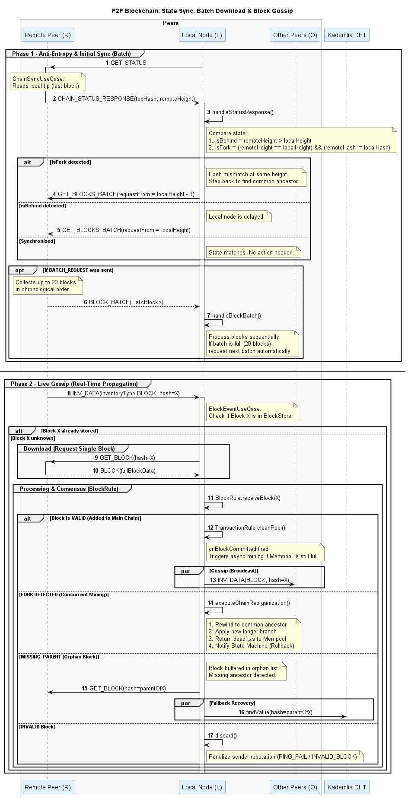

# Arquitetura de Rede Distribuída com Suporte a Churn, Pub/Sub e Replicação

A transição de uma rede de nós estáveis para um ambiente com Churn (entrada e saída arbitrária de nós), suportando Pub/Sub e Replicação, exige a adoção de mecânicas avançadas de estado distribuído. O que funcionou em ambiente local controlado irá colapsar numa rede real se não implementar as salvaguardas formais do protocolo Kademlia.

Abaixo, expõe-se com rigor arquitetural o que precisa de ser construído para cada um desses pilares, desmontando simultaneamente falhas conceptuais na propagação e subscrição de eventos.

---

## 1. Resolução de Concorrência da Cadeia de Blocos nas Réplicas

Antes de propagar um bloco para a rede e assumir que o objeto recebido sucede linearmente ao topo atual da cadeia local, o sistema deve precaver-se contra as seguintes questões inerentes a sistemas distribuídos:

* **Colisão de Alturas (Forks):** Ambas as réplicas podem partilhar a mesma altura de cadeia (por exemplo, altura 10), mas possuírem blocos com raízes criptográficas e transações totalmente diferentes. É obrigatório verificar o encadeamento ancestral e sincronizar a cadeia com base na validação de Hashes, e não apenas na altura.
* **Gestão de Órfãos:** Ao anunciar um bloco, a rede deve validar imediatamente o *Proof-of-Work* (PoW). Caso seja um candidato válido, o nó deve avaliar a sua ancestralidade. Se o bloco pai não existir localmente, o bloco recém-recebido tem de ser classificado temporariamente como "órfão", acionando um pedido de resgate (Missing-Parent).
* **Convergência no Arranque:** Ao inicializar uma réplica, o sistema deve garantir a transferência total da cadeia dominante, descartando ativamente ramificações secundárias mais curtas em prol da cadeia principal (Regra da Cadeia Mais Longa).

---

## 2. Gossip Otimizado (Pré-propagação e Anti-Entropia)

O diagrama de rede divide-se em duas mecânicas distintas que operam em paralelo em cada nó: a **Sincronização de Estado (Anti-Entropia)** e o **Gossip em Tempo Real**. Compreender o fluxo exato de mensagens e a matemática de comparação de cadeias é fundamental para o consenso.

### A Lógica Matemática: A Comparação de Cadeias

Antes de solicitar blocos, o nó local avalia se o vizinho remoto possui uma cadeia melhor ou divergente, cruzando os dados do payload remoto com o estado local através de três cenários:

1. **Atraso Detetado (`isBehind`)**
   * **Regra:** `remoteHeight > localHeight`
   * **Significado:** O nó local perdeu a sincronia e está blocos atrás da rede.
   * **Ação:** O nó solicita um lote de blocos começando no seu ponto atual de paragem (`requestFrom = localHeight`).

2. **Bifurcação Concorrente (`isFork`)**
   * **Regra:** `remoteHeight == localHeight` **E** `remoteHash != localHash`
   * **Significado:** Ambos os nós têm a mesma altura, mas com hashes finais diferentes, indicando que o PoW foi resolvido em simultâneo por nós distintos.
   * **Ação:** O nó local recua um índice (`localHeight - 1`) e solicita o bloco divergente ao vizinho para o armazenar na memória intermédia e resolver a ramificação vencedora.

3. **Sincronia Total (`Synchronized`)**
   * **Regra:** Alturas iguais e Hashes iguais.
   * **Ação:** Nenhuma mensagem adicional é enviada, minimizando o consumo de largura de banda.

### Fase 1: Sincronização e Anti-Entropia (Mensagens de Batch)

Ocorre no arranque do nó ou periodicamente (ex: a cada 15 segundos) como processo em segundo plano (Daemon).

* **`GET_STATUS`:** O nó local interroga o estado atual da cadeia do vizinho.
* **`CHAIN_STATUS_RESPONSE`:** O vizinho responde com a altura e o Hash do seu último bloco validado.
* **`GET_BLOCKS_BATCH`:** Caso detete atraso ou Fork, o nó local envia um `BATCH_REQUEST` solicitando um lote ordenado de blocos a partir de um índice específico.
* **`BLOCK_BATCH`:** O vizinho envia uma lista ordenada com um limite seguro (ex: 20 blocos) para não sobrecarregar os *buffers* TCP. O nó local processa os blocos sequencialmente.

### Fase 2: Gossip em Tempo Real (Propagação ao Milissegundo)

Garante a notificação instantânea da rede mal o processo de mineração encontra um *Nonce* válido.

* **`INV_DATA` (Inventory Data):** O mineiro envia apenas o Hash do novo bloco aos vizinhos. Se um nó já possuir este Hash, ignora o pacote.
* **`GET_BLOCK` / `GET_DATA`:** O nó recetor, caso desconheça o Hash anunciado, solicita explicitamente o conteúdo integral do bloco.
* **`BLOCK`:** O bloco completo é transmitido, sujeito a validação criptográfica (BlockRule), as transações da Mempool são purgadas e a Máquina de Estados atualiza o *Ledger* de Leilões.

---

## 3. Tratamento de Churn (Rotatividade da Rede)

O protocolo Kademlia não pressupõe que a rede seja perfeitamente fiável. Quando os nós se desconectam abruptamente, a tabela de roteamento sofre de **Bucket Pollution**. Devem ser implementadas as seguintes defesas:

* **Bucket Refresh (Refresco Periódico):** Uma rotina assíncrona deve iterar pelos *k-buckets* da `RoutingTable` a cada hora. Se um *bucket* não apresentar atividade recente, o nó gera um ID aleatório no intervalo desse *bucket* e executa um `FIND_NODE`, forçando a descoberta de novos nós e a remoção das ligações mortas.
* **Evicção Preguiçosa (Lazy Eviction):** Nunca remover um nó imediatamente após uma única falha de *Ping*. O nó inativo deve ser movido para uma lista de "suspeitos". Se um novo nó tentar entrar num *bucket* já cheio, o Kademlia faz *Ping* ao suspeito; a substituição só ocorre se a falha se confirmar, mitigando o risco de ataques Eclipse.

---

## 4. Replicação e Repropagação de Dados

Ao armazenar um estado na rede (`storage`), a informação é delegada aos **K nós mais próximos** (habitualmente, K = 20). Sob cenários de *Churn*, a rede perderá o dado se não aplicar a mecânica de repropagação contínua.

* **Repropagação Ativa (O Editor):** O nó criador do objeto (ou bloco) deve invocar a rotina de armazenamento para os K nós mais próximos a cada 24 horas, compensando a substituição gradual de vizinhos na rede.
* **Replicação Passiva (O Armazenador):** Qualquer nó que retenha um valor na sua DHT local deve repropagá-lo a cada hora para os restantes K-1 nós mais próximos. Se o nó receber um pedido de armazenamento para a mesma chave, o relógio de replicação local é reiniciado.
* **Handoff de Entrada:** Quando um novo nó ingressa na topologia, os vizinhos preexistentes devem rastrear a sua própria DHT. Se identificarem que o recém-chegado pertence agora ao grupo dos K mais próximos de determinadas chaves, devem enviar proativamente esses dados (Pré-propagação de Estabilização).