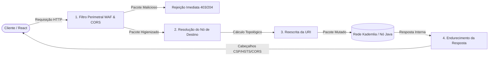

# Web Aplication Firewall

**Objetivo** – Definir, ilustrar e testar as principais funcionalidades de proteção que um WAF deve oferecer a uma API REST/gRPC.

Os tópicos a cobrir são:

* Detecção de XSS
* Detecção de injeção SQL
* Limitação de taxa (rate‑limiting)
* Detecção de robôs (bots)
* Prevenção de path‑traversal e de divulgação de ficheiros sensíveis (.env, /etc/passwd


## 2. Diagrama de fluxo do WAF



* **HeaderFilter** – aplica as regras de cabeçalho (ex.: método permitido, `Content‑Type`, `Authorization`).
* **BodyFilter** – inspecciona o corpo quando o WAF está configurado para o fazer (para REST/JSON). Em gRPC o corpo é binário; normalmente desactivamos a inspeção profunda e apenas controlamos o tamanho.
* **Upstream** – encaminha a requisição limpa para o serviço real.
* **Logging** – grava access‑logs, audit‑logs e métricas (ex.: número de bloqueios por regra).

---

## 3. Testes de segurança

A seguir estão alguns *curl* que simulam ataques típicos. Cada um tem uma breve explicação sobre o que deveria ser bloqueado pelo WAF.

### 3.1. Preflight CORS (OPTIONS)

```
curl-i-XOPTIONShttp://localhost:8080/api/bootstrap/\
-H"Origin: http://localhost:3000"\
-H"Access-Control-Request-Method: POST"\
-H"Access-Control-Request-Headers: Content-Type,Authorization"
```

* **Esperado:** `200 OK` (ou `204 No Content`) com cabeçalhos `Access-Control-Allow-*`.
* **Regra aplicada:** Permissão de `OPTIONS`; caso contrário, o WAF devolve `403`.

---

### 3.2. Injeção XSS na query string

```
curl-i"http://localhost:8080/api/peer-8002/auction?query=<script>alert(1)</script>"
```

* **Esperado:** `403 Forbidden` (regra XSS).
* **Regra aplicada:** `SecRule ARGS "@rx <script[^>]*>"`.

---

### 3.3. Tentativa de acesso a ficheiro confidencial

```
curl-i"http://localhost:8080/api/bootstrap/.env"
```

* **Esperado:** `403 Forbidden` (regra de divulgação de ficheiros).
* **Regra aplicada:** `SecRule REQUEST_URI "@rx \.env$"`.

---

### 3.4. Path‑traversal

```
curl-i"http://localhost:8080/api/peer-8005/../../../etc/passwd"
```

* **Esperado:** `403 Forbidden` (regra de path traversal).
* **Regra aplicada:** `SecRule REQUEST_URI "@rx /\.\./"`.

---

### 3.5. Injeção SQL na query string

```
curl-i"http://localhost:8080/api/peer-8002/auction?id=1' OR '1'='1"
```

* **Esperado:** `403 Forbidden` (regra SQLi).
* **Regra aplicada:** `SecRule ARGS "@rx (?:'|\")\\s*OR\\s+(?:'|\")"`.

---

### 3.6. Requisição legítima (conta‑registo)

```
curl-i"http://localhost:8080/api/peer-8005/kademlia/routing-table"
```

* **Esperado:** `200 OK` com o payload normal.
* **Regra aplicada:** Nenhuma das regras acima deve acionar.
